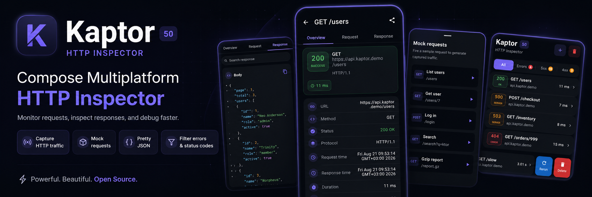

<p align="center">
  
</p>

# Kaptor

[](https://central.sonatype.com/artifact/io.github.akardas16/kaptor-core)
[](LICENSE)


A Kotlin Multiplatform HTTP inspector for **Android and iOS**, in the spirit of
[Chucker](https://github.com/ChuckerTeam/chucker) — but built on **Ktor** instead of OkHttp.
Install a Ktor client plugin, and every request/response is captured and browsable in a bundled
Compose Multiplatform UI shared across both platforms.

> Chucker is Apache-2.0; its data model and UX informed this project. The interception (Ktor
> plugin) and UI (Compose Multiplatform) are original — OkHttp is not required (use it as a Ktor
> engine if you like).

## Features

- **One Ktor plugin, both platforms** — `install(Kaptor)` captures every call; the same Compose UI
  renders on Android and iOS.
- **Request list** — status-colored badge tiles (2xx green · 3xx blue · 4xx red · 5xx amber · failed ·
  animated "pending"), filter chips (`All` / `Errors` / `5xx` / `4xx`) with live counts, and
  swipe-to-reveal **Rerun** / **Delete**.
- **Request detail** — hero status card, icon detail rows, and a Server card (IP / software from
  response headers), plus **Overview / Request / Response** tabs.
- **JSON viewer** — syntax-highlighted pretty-print, collapsible tree, and copy-to-clipboard.
- **Response search** — match count with prev/next navigation, scroll-to-match, and active-match
  highlighting — usable on very long bodies.
- **Header redaction** — name sensitive headers (`Authorization`, `Cookie`, …) and their values are
  scrubbed *before* anything is stored, displayed, or shared.
- **Retention limits** — cap captured traffic by age (`retentionPeriodMillis`) and/or count
  (`maxStoredTransactions`); the store prunes itself as new requests arrive.
- **Share** a transaction as **text**, **cURL**, or a **file**.
- **Mock requests** — fire scripted test traffic from a **+** sheet, so you can exercise the
  inspector without leaving it (host-supplied, engine-agnostic).
- **Content-Encoding decoding** — gzip/deflate on every platform (pure-Kotlin inflater on iOS),
  optional brotli on JVM/Android.
- **Android notification launcher** and a **no-op repository** for release builds.

## Modules

| Module | Contents |
|---|---|
| `:kaptor-core` | Ktor client plugin, `HttpTransaction` model, SQLDelight-backed `TransactionRepository`, JSON/format utilities. No UI dependency. |
| `:kaptor-ui` | Compose Multiplatform screens: transaction list + detail (Overview / Request / Response, JSON pretty-print, response search). Android + iOS. |
| `:kaptor-android` | Android-only launcher: a notification listing recent requests that opens the inspector in a full-screen `KaptorActivity` (Chucker parity). |
| `:kaptor-no-op` | `NoOpTransactionRepository` for release builds — keep the plugin installed with zero storage/UI overhead. |

## How it works

```
Ktor HttpClient
   └── install(Kaptor) ──► on(Send) hook
                                    ├─ capture method/url/headers/request body
                                    ├─ proceed(request)              (times the call)
                                    ├─ call.save()  ──► buffers response body so the
                                    │                    app AND the inspector can read it
                                    └─ write RequestSnapshot / ResponseSnapshot
                                          │
                                          ▼
                              TransactionRepository (SQLDelight)
                                          │  Flow<List<HttpTransaction>>
                                          ▼
                              KaptorScreen()  (Compose MP)
```

## Requirements

- Kotlin **2.3+**, Compose Multiplatform **1.11+**, Ktor **3.5+**
- Android **minSdk 24+**
- iOS **arm64 / simulatorArm64** (deployment target 15+)

## Installation

Artifacts are on Maven Central. Add the modules you need — KMP resolves the right per-platform
variant automatically:

```kotlin
dependencies {
    implementation("io.github.akardas16:kaptor-core:0.2.0")   // plugin + model + store
    implementation("io.github.akardas16:kaptor-ui:0.2.0")     // Compose inspector UI
    implementation("io.github.akardas16:kaptor-android:0.2.0") // Android notification launcher (optional)

    // Release builds: keep the plugin installed with zero overhead.
    releaseImplementation("io.github.akardas16:kaptor-no-op:0.2.0")
}
```

Or with a version catalog (`libs.versions.toml`):

```toml
[versions]
kaptor = "0.2.0"
[libraries]
kaptor-core    = { module = "io.github.akardas16:kaptor-core", version.ref = "kaptor" }
kaptor-ui      = { module = "io.github.akardas16:kaptor-ui", version.ref = "kaptor" }
kaptor-android = { module = "io.github.akardas16:kaptor-android", version.ref = "kaptor" }
kaptor-no-op   = { module = "io.github.akardas16:kaptor-no-op", version.ref = "kaptor" }
```

## Quick start

```kotlin
// 1. Build a repository (persists via SQLDelight)
val driverFactory = DatabaseDriverFactory(/* Android: context */)   // iOS/JVM: no args
val repository = TransactionRepository(driverFactory)

// 2. Install the plugin on your Ktor client
val client = HttpClient(OkHttp /* or Darwin on iOS */) {
    install(Kaptor) {
        repository = repository
        maxContentLength = 250_000        // bodies larger than this aren't captured
        // filter = { it.url.host != "metrics.internal" }   // optional

        // Scrub secrets before anything is stored/shared (case-insensitive):
        redactHeaders = setOf("Authorization", "Cookie", "Set-Cookie")

        // Bound how much captured traffic accumulates on disk (both optional):
        retentionPeriodMillis = 24 * 60 * 60 * 1000L   // prune anything older than 24h
        maxStoredTransactions = 500                    // keep only the newest 500
    }
}

// 3. Show the inspector anywhere in your app (debug menu, shake gesture, …)
KaptorScreen(repository)
```

### Android notification launcher (Chucker parity)

Add `:kaptor-android` and start it once (debug builds). A notification then tracks recent
requests and opens the inspector on tap:

```kotlin
KaptorAndroid.install(context, repository)   // posts/updates the notification
// KaptorAndroid.launch(context)             // open the UI directly, no notification
// KaptorAndroid.uninstall()                 // stop it
```

On Android 13+ the host app must hold the `POST_NOTIFICATIONS` runtime permission (the module
declares it in its manifest, but you must request it at runtime); without it the notification is
silently skipped and the in-app `KaptorScreen` still works.

**Rerun + mock requests.** The swipe "Rerun" action and the **+** mock-requests sheet re-issue
requests through *your* Ktor client (the inspector has none), so you supply them:

```kotlin
val rerunner = KaptorRequestRerunner { tx ->
    scope.launch { client.request(tx.url!!) { method = HttpMethod.parse(tx.method ?: "GET") /* … */ } }
}
val mockRequests = listOf(
    KaptorMockRequest("List users", method = "GET", subtitle = "/users") {
        client.get("https://api.example.com/users")
    },
)
KaptorAndroid.install(context, repository, rerunner, mockRequests)
```

Embedding `KaptorScreen` directly instead? Provide the same via
`CompositionLocalProvider(LocalKaptorRequestRerunner provides rerunner, LocalKaptorMockRequests provides mockRequests) { KaptorScreen(repository) }`.

### iOS entry point

On iOS the inspector is presented as a `UIViewController`. In your **shared Kotlin** module, build
the repository once and reuse it for both the Ktor client and the UI:

```kotlin
// shared module (commonMain / iosMain)
object KaptorProvider {
    val repository = KaptorIos.createRepository()   // SQLDelight-backed
    val client = HttpClient(Darwin) {
        install(Kaptor) { repository = KaptorProvider.repository }
    }

    // Optional — enable the swipe "Rerun" action and the "+" mock-requests sheet. Both send
    // through `client`, so build them here in shared Kotlin (Swift can't create suspend lambdas).
    val rerunner = KaptorRequestRerunner { tx -> /* rebuild + client.request(tx.url) */ }
    val mockRequests = listOf(
        KaptorMockRequest("List users", method = "GET", subtitle = "/users") {
            client.get("https://api.example.com/users")
        },
    )
}
```

Then present it from Swift (full sample in [`samples/ios/KaptorSample.swift`](samples/ios/KaptorSample.swift)):

```swift
struct KaptorView: UIViewControllerRepresentable {
    let repository: TransactionRepository
    func makeUIViewController(context: Context) -> UIViewController {
        KaptorIos.shared.viewController(
            repository: repository,
            rerunner: KaptorProvider.shared.rerunner,       // or nil
            mockRequests: KaptorProvider.shared.mockRequests // or []
        )
    }
    func updateUIViewController(_ vc: UIViewController, context: Context) {}
}
// present KaptorView(repository: KaptorProvider.shared.repository) in a .sheet
// Minimal form (no rerun / no + sheet): KaptorIos.shared.viewController(repository: repository)
```

> Use the **same** `repository` instance for the client plugin and the view controller — otherwise
> the UI shows no traffic. gzip/deflate decode on iOS; brotli bodies show an "encoded body" note.

A **runnable iOS sample** (SwiftUI app + `Shared.framework`) lives in
[`sample-ios/`](sample-ios/README.md) — build it with Gradle + xcodegen + xcodebuild and run it on a
simulator, the iOS analogue of `:sample-android`.

For release builds, swap the repository:

```kotlin
val repository = if (isDebug) TransactionRepository(driverFactory)
                 else NoOpTransactionRepository()
```

## Sample apps

Both samples use a `MockEngine`-backed client, so they run offline and deterministically.

| Sample | Run |
|---|---|
| [`:sample-android`](sample-android) | `./gradlew :sample-android:installDebug` |
| [`sample-ios/`](sample-ios/README.md) | Gradle framework → xcodegen → xcodebuild → simulator (see its README) |

## Publishing

Artifacts are published with the [vanniktech maven-publish plugin](https://vanniktech.github.io/gradle-maven-publish-plugin/)
under the coordinates in `gradle.properties` (`GROUP` / `VERSION_NAME`):

```
io.github.akardas16:kaptor-core:0.2.0
io.github.akardas16:kaptor-ui:0.2.0
io.github.akardas16:kaptor-android:0.2.0
io.github.akardas16:kaptor-no-op:0.2.0
```

> Replace `akardas` in `gradle.properties` (GROUP + POM url/scm/developer) with your own GitHub
> username — `io.github.<user>` must match a namespace you verify on the Sonatype Central Portal.

**Dry run (no account needed):**

```
./gradlew publishToMavenLocal   # writes all four modules to ~/.m2
```

**Release to Maven Central:** create a [Central Portal](https://central.sonatype.com/) account, verify
your namespace, generate a GPG key, and put credentials in `~/.gradle/gradle.properties`:

```
mavenCentralUsername=<portal token user>
mavenCentralPassword=<portal token>
signingInMemoryKey=<ascii-armored GPG private key>
signingInMemoryKeyPassword=<key passphrase>
```

then:

```
./gradlew publishAndReleaseToMavenCentral --no-configuration-cache
```

Signing is applied automatically only when a signing key is present, so the local dry run works
without one. The sample modules are not published.

## Building & testing

```bash
./gradlew :kaptor-core:jvmTest                 # capture-plugin + inflate tests (JVM)
./gradlew :kaptor-core:iosSimulatorArm64Test   # same tests, natively on the iOS simulator
./gradlew publishToMavenLocal                  # build all targets + validate publishing
```

CI (`.github/workflows/ci.yml`) runs these on every PR; tagged releases publish to Maven Central
via `.github/workflows/release.yml`.

**Content-Encoding note:** responses are read as raw bytes and decompressed per `Content-Encoding`
(including stacked encodings like `deflate, gzip`). gzip/deflate work on all platforms — Android/JVM
via `java.util.zip`, iOS via a bundled pure-Kotlin inflater (no cinterop), validated by
`PureInflateTest`. Brotli is available on Android/JVM via the optional `org.brotli:dec` dependency
(loaded reflectively; add `implementation("org.brotli:dec:0.1.2")` to enable); on iOS such bodies
show an "encoded body" note.

## Roadmap

- multipart / form-data body rendering
- charset handling beyond UTF-8
- streaming request-body capture (currently skipped to avoid consuming the source)
- Swift Package / CocoaPods distribution of the iOS framework (Gradle/KMP consumers are supported today)

## License

Copyright 2026 Abdullah Kardas

Licensed under the Apache License, Version 2.0 — see [LICENSE](LICENSE) for details.
